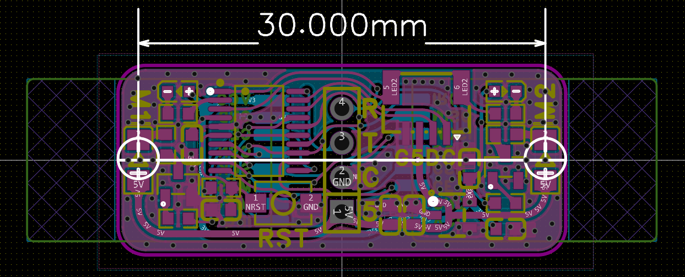

## WKDoubleTXG0 User Manual

WKTX 双通道高频收发器

### 基本参数

工作于2.4G频段

基于国产芯片SI24R1 兼容NRF24L01 低成本 高性能

主控芯片STM32G030F6P6 硬件性价比极高

使用4Pin接口和主机通信，使用UART省去SPI大量接口

支持对两个模块的参数进行任意单独配置，例如DoubleRX DoubleTX RXTX模式等

支持用户自定义数据包，单个数据包最大32Bytes

### 如何发送数据

只要一个模块处于发送模式，就可以通过串口指定模块发送数据。

如果指定模块1发送数据，则发送如下数据包即可：

| 帧头: 0xD1 | 数据载荷: 30Bytes | 帧尾: 0x51 |
| ---------- | ----------------- | ---------- |

指定模块2发送数据：

| 帧头: 0xD2 | 数据载荷: 30Bytes | 帧尾: 0x52 |
| ---------- | ----------------- | ---------- |

如果指定模块1和模块2同时发送数据：

| 帧头: 0xD3 | 数据载荷: 30Bytes | 帧尾: 0x53 |
| ---------- | ----------------- | ---------- |

###  如何接收数据

如果一个模块处于接收模式，并且接收到数据，则收到的数据包会自动通过串口传输到主机。

### 如何配置模块

通过主机向模块发送配置数据包，可以对SI24R1各项参数进行配置。

支持配置的参数：

1.模块收发模式（接收模式 or 发射模式）

2.模块发射功率（7个等级 不同的SI24R1芯片类别具体功率不同 请查阅数据手册）

3.模块工作信道（2400MHz~2525MHz 共126个 1MHz带宽的信道）

4.模块空速（250kbps 1Mbps 2Mbps 三种空中速率）

5.模块发射地址（5字节长度）

6.模块6个通道的接收地址

配置数据包格式：

如果要配置模块1：

| 帧头: 0xC1 | 配置数据: 30Bytes | 帧尾: 0x41 |
| ---------- | ----------------- | ---------- |

如果要配置模块2：

| 帧头: 0xC2 | 配置数据: 30Bytes | 帧尾: 0x42 |
| ---------- | ----------------- | ---------- |

如果要同时配置两个模块：

| 帧头: 0xC3 | 配置数据: 30Bytes | 帧尾: 0x43 |
| ---------- | ----------------- | ---------- |

配置数据共30字节，具体格式定义如下：

| Mode | Power | Channel | Speed | Tx   | R0   | R1   | R2   | R3   | R4   | R5   |
| ---- | ----- | ------- | ----- | ---- | ---- | ---- | ---- | ---- | ---- | ---- |

各部分详细解释：

**Mode** 模块工作模式 1Byte

| Value 数值   | 0           | 1           |
| ------------ | ----------- | ----------- |
| 模块工作模式 | TX 发射模式 | RX 接收模式 |

**Power** 模块发射功率 1Byte

| Value 数值   | 0~7                |
| ------------ | ------------------ |
| 模块发射功率 | 发射功率等级 共8档 |

**Channel** 模块工作信道 1Byte

| Value 数值             | 0~125                            |
| ---------------------- | -------------------------------- |
| 模块工作信道(工作频率) | 共126个信道，对应2400MHz~2525MHz |

**Speed** 模块空中速率 1Byte

| Value 数值   | 0       | 1     | 2     |
| ------------ | ------- | ----- | ----- |
| 模块空中速率 | 250kbps | 1Mbps | 2Mbps |

**Tx** 模块发射地址 **5Bytes**

**R0** 模块接收通道0地址 **5Bytes**

**R1** 模块接收通道1地址最后一个字节 **1Byte**

**R2** 模块接收通道2地址最后一个字节 **1Byte**

**R3** 模块接收通道3地址最后一个字节 **1Byte**

**R4** 模块接收通道4地址最后一个字节 **1Byte**

**R5** 模块接收通道5地址最后一个字节 **1Byte**

###  模块配置注意事项

1.在一个信道内，若有多个模块同时发送，有可能会产生冲突，导致无法接收数据。

2.若两个模块之间想要通信，则必须处于相同的工作信道以及空速。

3.此模块工作在2.4G频段，有可能对周围的WIFI设备或者蓝牙设备产生干扰，若出现干扰可尝试切换信道。

4.要想发射和接收，则对应的发射地址和接收地址需要对应。

5.模块共有6个接收通道，也就是可以实现6个发射1个接收的星型网络。注意的是，只有接收通道0的5个字节的地址是可以自由指定的，接收通道1-5的前4个字节要求和接收通道0的前4个字节一致，也就是只能自由设置最后一个字节。

### 模块LED灯状态含义

模块含有两个独立的LED，分别表示模块1和模块2的工作状态：

| 熄灭                | 模块初始化失败，存在硬件错误       |
| :------------------ | ---------------------------------- |
| 常亮                | 处于发射模式                       |
| 1s周期50%占空比慢闪 | 处于接收模式，但是没有正在接收数据 |
| 1s周期快速双闪      | 处于接收模式，并且正在接收数据     |

### 模块其他功能

此模块有两个可通过PWM调光的主动式红外信标。

用户可自定义串口指令实现模块对于信标光强的调节，程序里已经编写相关接口。

两个信标使用1206封装的红外LED，位置距离模块中心15mm

